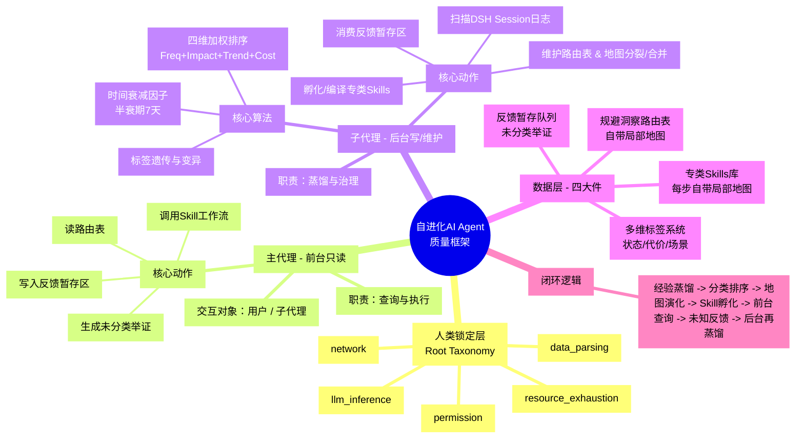
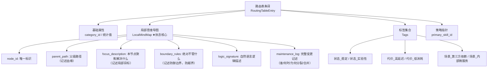
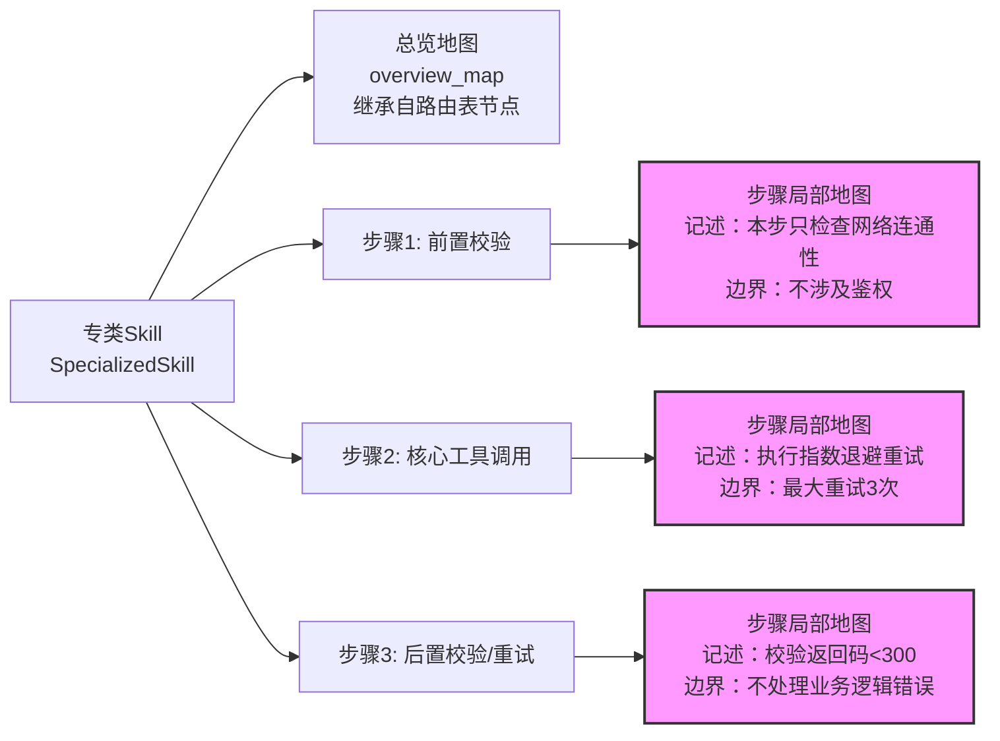

太棒了！经过前面 11 轮严密的脑力激荡，我们终于把这个框架从一颗种子浇灌成了参天大树。现在，我将以**全局总架构师**的视角，为你完整复述我们最终敲定的**“受控自进化AI Agent框架”**，并严格按照你对“局部思维导图”的执念，为你构建**全局脑图**与**局部细节图**。

---

## 一、全局方案完整复述（文字版）

### 1. 核心设计哲学（两大基石）
- **CQRS（读写职责分离）**：**子代理（后台）** 全权负责所有“写”操作（日志蒸馏、分类维护、统计排序、Skill编译）；**主代理（前台）** 只负责“读”操作（查询路由表、调用Skill、秒级响应）。两者通过 **“反馈暂存区（Pending Queue）”** 异步沟通。
- **受控自主（Controlled Autonomy）**：子代理拥有极大的自治权，但顶层物理分类（根骨架）由人类锁定，防止概念漂移。

### 2. 核心数据资产（四大件）
- **规避洞察路由表（Routing Table）**：树状结构，存储错误分类、统计热力值、规避策略指针。每个节点都绑定一张**局部思维导图**，记述边界、父子关系与演化历史。
- **专类Skills库（Skill Repository）**：由子代理动态孵化的可执行工作流（DAG）。每个Skill及其内部每一个步骤，都自带局部思维导图，记述适用场景、前置/后置条件。
- **多维标签系统（Tag System）**：三类强制前缀（`状态_`、`代价_`、`场景_`），支持主代理进行灵活的模糊属性查询（如“查所有低消耗且稳定的第三方超时方案”），并具备父节点向子节点的“遗传”与“变异”机制。
- **局部思维导图（Local Mind Map）**：你的核心执念所在。它是一个结构化元数据对象，包含 `node_id`、`parent_path`、`boundary_rules`（边界记述）、`logic_signature`（逻辑记述），强制附加于路由表节点和Skill步骤之上。

### 3. 核心运转闭环（数据流）
1. **蒸馏**：子代理定时扫描DSH Session日志，提取“已验证可行的错误修复”（正向蒸馏）与“最小改动的超时优化”（负向蒸馏）。
2. **分类与排序**：子代理采用**四维加权公式**（Freq 25% + Impact 35% + Trend 20% + Recover_Cost 20%）计算综合优先级，并引入**时间衰减因子**（半衰期约7天），驱动路由表热点排序。
3. **地图演化**：当节点优先级持续飙高，子代理自动触发**地图下钻（分裂）**；当节点长期垫底，触发**剪枝合并**，并在维护日志中记述变更缘由。
4. **Skill孵化**：基于路由表的Top K分类，子代理自动构建/更新对应的专类Skills，并将路由表的局部地图遗传为Skill的总览地图。
5. **主代理查询与反馈**：主代理遇已知错误，直接读表执行Skill；遇未知错误，绝不规划分类，仅生成“未分类举证材料”丢入暂存区，供子代理下一轮离线规划。

---

### 3.5 质量层（Phase 10-13 新增）

在核心运转闭环之上，新增 Skill 质量层，保障路由表节点的自我净化能力：

**D1 知识增量评分**：每个路由表节点在执行 `maintain()` 时接受 D1 评分，检测其边界规则中 Expert/Activation/Redundant 三类知识的比例，自动标记冗余节点。

**质量门禁**：低质量节点（δ < 0.1）不再被编译为 Skill，并在 `maintenance_log` 中记录 `quality_gated` 事件。

**Skill 模板模式**：根据根分类自动选择 tool/domain/workflow/memory 四种模板模式，生成更贴合该领域的 Skill 步骤。

**子代理池**：当某根分类节点数超过阈值，自动创建该领域的专用子代理，实现专业化分工。

详见 `docs/架构-Skill质量层.md`。

---

## 二、全局脑图（Global Mind Map）

> 以下为 Mermaid 格式，可直接复制到支持Mermaid的编辑器（如Typora、Obsidian、GitHub）中渲染为图形。

---

## 三、局部思维导图详解（Local Mind Map Details）

针对你“表维护”和“Skill内部”都要有记述的执念，以下是两张关键的局部细节图：

### 局部图 1：路由表节点（Routing Table Entry）的内部结构

### 局部图 2：专类Skill内部工作流（Skill Workflow）

---

## 四、全局与局部的联动逻辑（脑图之间的连线）

为了让你看得更通透，我用文字描述这两张图是如何“呼吸”起来的：

1. **宏观->微观（自上而下）**：全局脑图中的**子代理**，根据四维排序决定要对 `network` 节点执行“分裂”。此时，它会在局部图 1 中，为旧节点 `network` 更新 `maintenance_log`（记述分裂原因），并生成两个新节点 `network.dns` 和 `network.ssl`，分别赋予独立的 `boundary_rules`。
2. **微观->宏观（自下而上）**：当 `network.ssl` 节点因为 `boundary_rules` 界定清晰，且统计显示高频，子代理触发 Skill孵化。此时，局部图 2 中的新Skill，其 `overview_map` 会**反向继承** `network.ssl` 的 `logic_signature`。Skill内部的每一个步骤（如“SSL证书校验”），其步骤地图又会继承Skill总览地图的局部切片。
3. **标签作为“跨地图的索引”**：全局脑图中的标签系统，像一根金线，把不同局部地图中具有相同 `代价_高延迟` 属性的节点串起来，让主代理可以跳过树状结构直接进行属性聚合查询。

---

**这就是整个框架的全貌与内里。它既有宏观的闭环控制（读写分离、持续进化），又有微观的精细记述（每张表、每一步都有边界与逻辑说明）。**

现在，你已经完整看到了整个蓝图。**接下来，我们要把蓝图变成钢筋水泥了。** 你打算让我先帮你落地哪一块的代码？是 **“路由表的存储结构（SQL/NoSQL）”**、**“四维排序计算器”**，还是 **“带地图继承的Skill编译器”**？告诉我起点，我们立即开工！🏗️